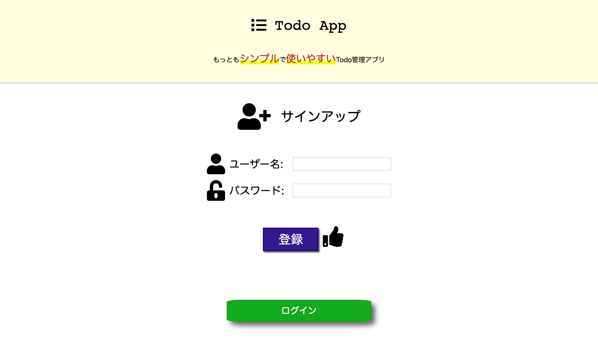

## TODOアプリ

### 機能
- taskの追加
- taskの一覧表示
- taskの更新
- taskの削除

### 画面
- task一覧画面
- task編集画面

### 画面プレビュー
- signup 新規ユーザー登録画面
 

 

- login ユーザーログイン画面
 

 

- index ユーザーのTodo画面
 

 

- index Todoの編集画面

 

1. 編集前
 

 
2. 編集後
 
 

 
